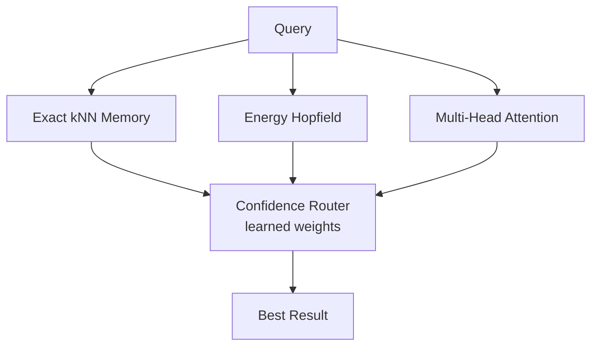

<div align="center">
  <!-- You can add a logo here:  -->
  <h1>🧠 Engramma Memory</h1>
  <p><strong>The memory engine for AI that <em>thinks</em> — not just retrieves.</strong></p>
  <p>Composition. Generalization. Causal reasoning. One <code>pip install</code> away.</p>

  <p>
    <a href="https://pypi.org/project/engramma-memory/"></a>
    <a href="https://www.python.org/downloads/"></a>
    <a href="LICENSE"></a>
    <a href="https://github.com/engramma-ai/engramma-memory/actions"></a>
    <a href="https://doc.engramma-memory.com"></a>
  </p>

  <h4>
    <a href="#-quickstart">Get Started</a> &nbsp;&bull;&nbsp;
    <a href="#-why-engramma">Why Engramma?</a> &nbsp;&bull;&nbsp;
    <a href="#-how-it-works">Architecture</a> &nbsp;&bull;&nbsp;
    <a href="#%E2%98%81%EF%B8%8F-engramma-cloud">Cloud</a> &nbsp;&bull;&nbsp;
    <a href="https://doc.engramma-memory.com">Documentation</a>
  </h4>
</div>

---

> **Vector databases retrieve. Engramma *composes*.**
> Your agent asks: "What do you know about Python AND machine learning?"
> ChromaDB returns two separate results. Engramma returns **one fused answer**.

## 📖 Table of Contents
- [The Problem](#-the-problem)
- [Quickstart](#-quickstart)
- [Why Not Just Use a Vector DB?](#-why-not-just-use-a-vector-db)
- [How It Works](#-how-it-works)
- [Benchmarks](#-benchmarks)
- [Integrations](#-integrations)
- [Engramma Cloud](#%E2%98%81%EF%B8%8F-engramma-cloud)
- [Contributing](#-contributing)

---

## 🚩 The Problem

Every AI memory system today is just **retrieval** — find the nearest vector, return it. That's a search engine, not a memory. Real memory does more:

- 🧩 **Composes** — "What's the intersection of X and Y?" → a single coherent answer
- 🧠 **Generalizes** — noisy input still triggers the right pattern
- 📈 **Adapts** — frequently accessed patterns become stronger
- 🗑️ **Forgets** — outdated patterns decay naturally

Engramma does all four. In 3 lines of code.

---

## ⚡ Quickstart

### Installation

```bash
pip install engramma-memory
```

### Basic Usage

```python
import numpy as np
from engramma_memory import EngrammaMemory

# Initialize local, purely in-memory engine
mem = EngrammaMemory(dim=256, backend="local")

# Store knowledge
mem.store(key=embedding_a, value="Python is a programming language")
mem.store(key=embedding_b, value="Machine learning uses data to learn")

# Retrieve — smart routing across 3 pathways
result = mem.retrieve(query_embedding)

# Compose — the killer feature ⚡
blend = mem.compose([embedding_a, embedding_b])  
# Native multi-head attention fusion returns a coherent response
```

> [!NOTE]
> That's it. No config files. No Docker. No API keys. Just `numpy`.

---

## 🆚 Why Not Just Use a Vector DB?

When combining concepts using traditional vector databases, you are forced to retrieve multiple results and manually piece them together. Engramma solves this with **native composition**.

### The Vector DB Way
```python
# ChromaDB / Pinecone / FAISS — you get TWO separate results
result_a = db.query(key_a)  # "Python is a language..."
result_b = db.query(key_b)  # "ML uses data to learn..."

# Now what? Average them? Concatenate? Pray?
blend = (result_a + result_b) / 2  # Meaningless arithmetic
```

### The Engramma Way
```python
# Engramma — you get ONE fused answer
blend = mem.compose([key_a, key_b])  
# Each head specializes: some recall A, some recall B → coherent fusion
```

| Feature | Traditional Vector DBs | **Engramma** |
|:---|:---:|:---:|
| 🔍 Nearest-neighbor search | ✅ | ✅ |
| 🧩 **Native composition** | ❌ | **✅** |
| 🧠 Soft generalization (Hopfield)| ❌ | **✅** |
| 🔀 Adaptive routing | ❌ | **✅** |
| 📉 Importance-based eviction | ❌ | **✅** |
| 🍂 Gradual forgetting | ❌ | **✅** |
| 📦 Zero dependencies | ❌ | **✅** (numpy only) |

---

## 🏗️ How It Works

Engramma uses a multi-pathway architecture to route queries intelligently based on the task.



- **Exact Memory** — perfect recall via kNN with importance scoring
- **Energy Memory** — soft generalization via temperature-scaled Hopfield dynamics
- **Multi-Head Attention** — each head attends to different patterns → native composition
- **Confidence Router** — learns which pathway handles which query type

> [!TIP]
> All learning is **local** (Hebbian). No backpropagation. No GPU required. Pure NumPy.

---

## 📊 Benchmarks

Engramma trades a tiny bit of raw speed for massive gains in composition capability.

| Task | Engramma | FAISS | ChromaDB | Raw kNN |
|:---|:---:|:---:|:---:|:---:|
| Exact recall @1000 | 100% | 100% | 100% | 100% |
| **Composition (2-way)** | **81.4%** | 70.6% | 70.0% | 70.3% |
| **Composition (3-way)** | **68.4%** | 56.6% | 57.0% | 55.9% |
| **Continual learning** | **8.6%** | 1.1% | 1.1% | 1.1% |
| Noisy retrieval (σ=0.3)| 70.0% | 70.5% | 72.0% | 62.5% |

<details>
<summary>⏱️ <strong>Latency & memory (honest tradeoffs)</strong></summary>

| Metric | Engramma | FAISS | ChromaDB |
|:---|:---:|:---:|:---:|
| Latency p50 @1000 | 8.8ms | 0.02ms | 0.75ms |
| Memory (MB/1000) | 3.14 | 0.72 | 0.46 |

Engramma trades raw speed for composition capability. For pure nearest-neighbor at millions of vectors, use FAISS. For AI agents that need to *think* with their memory, use Engramma.
</details>

---

## 🔌 Integrations

Engramma drops right into your existing AI stack.

<details open>
<summary><strong>LangChain</strong></summary>

```python
from engramma_memory.integrations.langchain import EngrammaLangChainMemory

memory = EngrammaLangChainMemory(dim=256, embed_fn=fn)
```
</details>

<details>
<summary><strong>LlamaIndex</strong></summary>

```python
from engramma_memory.integrations.llamaindex import EngrammaRetriever

retriever = EngrammaRetriever(dim=256, embed_fn=fn)
```
</details>

<details>
<summary><strong>OpenAI Assistants</strong></summary>

```python
from engramma_memory.integrations.openai_assistants import engramma_tool_definitions

tools = engramma_tool_definitions()
```
</details>

<details>
<summary><strong>FastAPI</strong></summary>

```python
from engramma_memory.integrations.fastapi import create_memory_router

app.include_router(create_memory_router(dim=256))
```
</details>

---

## ☁️ Engramma Cloud

### Same API. No limits. 43 premium capabilities.

**One line to production:**

```python
# Local (free, open source, limited to 1000 patterns)
mem = EngrammaMemory(dim=256, backend="local")

# Cloud (unlimited, persistent, intelligent) — same code, one line change!
mem = EngrammaMemory(dim=256, backend="cloud", api_key="nx_live_...")
```

> [!IMPORTANT]
> **[Get Your Free API Key →](https://www.engramma-memory.com/signup)**

### What Cloud Unlocks

| Feature | Local (free) | Cloud |
|:---|:---:|:---:|
| 🗃️ **Max patterns** | 1,000 | **Unlimited** |
| 💾 **Storage** | RAM only | **Tiered (hot/warm/cold)** |
| ⚖️ **Composition weights** | Equal only | **Custom fractional (0.0–1.0)** |
| 🛡️ **Persistence** | None (in-process) | **Durable + snapshots** |
| 🧠 **Routing** | Confidence-based | **Active Inference + phi_B** |
| 🔗 **Causal reasoning** | — | **DAG discovery + interventions** |
| 🚨 **Anomaly detection** | — | **3-regime safety system** |
| 🔮 **Temporal prediction**| — | **Granger causality + prefetch** |
| 💬 **Text interface** | — | **HDC tokenizer (no embeddings needed)** |
| 🔬 **Explainability** | — | **Full XAI dashboard** |

### Cloud Feature Highlights

<details>
<summary><strong>Causal Reasoning & Safety</strong></summary>

```python
# Discover causal structure
graph = mem.get_causal_graph()

# "If I change A, what happens to B?"
effect = mem.predict_causal_effect(cause_key=a, effect_key=b)

# Fractional composition (not just 50/50)
blend = mem.compose_fractional(a, b, alpha=0.7)

# Auto-block risky OOD compositions
mem.enable_anomaly_protection(enabled=True)
```
</details>

<details>
<summary><strong>Text Memory & Explainability</strong></summary>

```python
# Store with natural language (no embeddings needed!)
mem.store_text("User prefers Python over JS")

# Query with natural language
results = mem.query_text("what language does the user prefer?")

# Understand WHY a result was returned
explanation = mem.explain(query)
# { pathway: "attention", confidence: ..., attention_map: [...] }
```
</details>

<details>
<summary><strong>Async Support</strong></summary>

For production async frameworks (FastAPI, etc.):
```python
from engramma_memory import EngrammaMemoryAsync

async with EngrammaMemoryAsync(dim=256, backend="cloud", api_key="...") as mem:
    await mem.store(key=embedding, value=data)
    results = await mem.query(embedding, top_k=5)
```
</details>

---

## 🤝 Contributing

We welcome contributions! See [CONTRIBUTING.md](CONTRIBUTING.md) for details.

```bash
git clone https://github.com/engramma-ai/engramma-memory.git
cd engramma-memory
pip install -e ".[dev]"
pytest  # 39 tests, all green
```

---

<div align="center">
  <h2>Ready for production?</h2>
  <p><strong>Local is free forever.</strong> When you hit the wall — 1000 patterns, no persistence, no causal reasoning — Cloud is one line away.</p>
  <a href="https://www.engramma-memory.com/signup"></a>
  <br/><br/>
  <p>
    MIT License &bull; 
    <a href="https://doc.engramma-memory.com">Documentation</a> &bull; 
    <a href="https://github.com/engramma-ai/engramma-memory">GitHub</a> &bull; 
    <a href="https://github.com/engramma-ai/engramma-memory/issues">Issues</a>
  </p>
</div>
